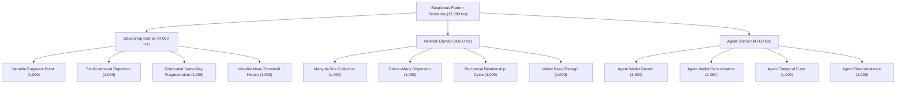
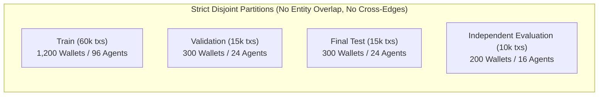

# Stage 10C — Final 100,000-Transaction Dataset Population & Scenario Specification

**Date:** 2026-09-14  
**Status:** **SPECIFICATION COMPLETE — PENDING RESEARCHER APPROVAL (NOT READY FOR DATA GENERATION)**  
**Role:** Senior ML Data-Engineering & AML Research Auditor  
**Domain Scope:** Structuring Behaviour, Wallet/Transaction Network Behaviour, Agent Behaviour (Zimbabwe Mobile Money / EcoCash Framing)  
**Baseline:** Stage 10B Architecture Locked (Exact 30-Feature Vector, Binary Target `0=normal`, `1=suspicious_pattern_scenario`)

---

## 1. Executive Summary & Non-Negotiable Stage 10B Baseline

Stage 10B established an immutable architecture lock on the AML feature matrix and decision-support scope. Stage 10C establishes the complete research-defensible dataset, population, scenario, and isolation specification for generating the target **100,000-transaction** synthetic dataset.

### 1.1 Non-Negotiable Baseline Invariants
- **Approved AML Scope:** Exclusively (1) Structuring, (2) Wallet/Transaction Network Behaviour, and (3) Agent Behaviour.
- **Decision-Support Constraint:** The system identifies anomalous behavioural patterns to assist compliance analysts; it does **not** prove money laundering.
- **Locked Feature Vector:** Exactly 30 features ($X \in \mathbb{R}^{30}$) as defined in `stage10b_feature_specification.json`. No feature additions, removals, renamings, window modifications, or threshold alterations are permitted.
- **Classification Target:** Strictly **binary** (`0 = normal`, `1 = suspicious_pattern_scenario`). Legacy 3-class definitions (`normal`, `suspicious`, `super_suspicious`) and rule/risk-derived labels are strictly prohibited.
- **Strict Change Control:** No synthetic transactions are generated in this stage; no models are trained; no application code or database schemas are altered.

---

## 2. Research Context & Lessons from Historical Stages (Stages 16B–24)

Historical iterations (Stages 16B through 24) provided crucial experimental findings that govern the design of Stage 10C:
1. **Narrow Suspicious Cohorts:** In Stage 16B, suspicious transactions were confined to just 14 customers (9 suspicious, 5 super-suspicious) out of 200. Models memorized customer volume idiosyncrasies rather than transferable typologies.
2. **Artificial Balancing Fallacy:** Stage 21 forced an artificial 50/50 class distribution, producing an apparent Macro F1 of 0.928. However, the Stage 22 generalization audit revealed catastrophic failure on unseen customers (Macro F1 plunged to 0.467), with the classifier defaulting to high-risk predictions due to class prevalence distortion.
3. **Template Shortcut Learning:** If synthetic scenarios use rigid amounts (e.g., structuring always at \$9,500), fixed transaction counts, or specific agent assignments, tree-based models learn partition boundaries based on single features rather than multivariate temporal dynamics.
4. **Stage 10C Mandate:** Stage 10C guarantees broad entity distribution, parametric variance, hard-negative inclusion, and multi-partition entity isolation.

---

## 3. Step 1 — Final 100,000-Transaction Population Design

| Parameter | Specification | Classification |
|---|---|---|
| **Total Transactions** | Exactly 100,000 | `APPROVED FROM STAGE 10B` |
| **Total Customers** | 2,000 synthetic customers | `REQUIRES USER/RESEARCHER APPROVAL` |
| **Total Wallets** | 2,000 synthetic wallets (1:1 mapping with customers) | `REQUIRES USER/RESEARCHER APPROVAL` |
| **Total Agents** | 160 registered mobile-money agents | `REQUIRES USER/RESEARCHER APPROVAL` |
| **Wallet Transaction Distribution** | Bounded over-dispersed discrete distribution: 35 to 75 transactions per wallet (Mean: 50.0 tx/wallet) | `REQUIRES USER/RESEARCHER APPROVAL` |
| **Agent Transaction Distribution** | 75,000 agent-mediated transactions distributed across 160 agents (Mean: ~469 tx/agent; Range: 150 to 900) | `REQUIRES USER/RESEARCHER APPROVAL` |
| **Agent-Mediated Share** | 75.0% (75,000 transactions) | `REQUIRES USER/RESEARCHER APPROVAL` |
| **Non-Agent-Mediated Share** | 25.0% (25,000 transactions: direct wallet-to-wallet P2P) | `REQUIRES USER/RESEARCHER APPROVAL` |
| **Minimum Wallet History** | Minimum 12 prior baseline transactions before wallet is eligible for scenario injection; all wallets receive at least 20 normal transactions overall | `REQUIRES USER/RESEARCHER APPROVAL` |
| **Minimum Agent History** | Minimum 30 prior agent-mediated transactions before agent-level scenario injection | `REQUIRES USER/RESEARCHER APPROVAL` |
| **Cold-Start Handling** | Strict Stage 10B neutral/no-evidence policy: all rolling sums, counts, ratios, entropy, and Z-scores return 0.0 until required historical depth is met | `APPROVED FROM STAGE 10B` |

### Rationale:
- **2,000 Wallets / 50 tx average:** Provides an authentic longitudinal history for 7-day and 30-day rolling windows while ensuring customer diversity is $10\times$ larger than Stage 16B/24, preventing customer ID memorization.
- **160 Agents:** Reflects the agent-banking structure of Zimbabwe mobile money (EcoCash agent kiosks). 160 agents allow 96 train, 24 validation, 24 test, and 16 independent agents without cross-contamination.
- **75% Agent-Mediated:** Reflects cash-in (cash-to-wallet) and cash-out (wallet-to-cash) dominance in cash-intensive developing economies, providing sufficient observations for all 14 agent features.

---

## 4. Step 2 — Binary Target & Class Distribution

| Target Class | Label | Transaction Count | Percentage | Classification |
|---|:---:|:---:|:---:|---|
| **Normal Behaviour** | `0` | 88,000 | 88.0% | `REQUIRES USER/RESEARCHER APPROVAL` |
| **Suspicious Pattern Scenario** | `1` | 12,000 | 12.0% | `REQUIRES USER/RESEARCHER APPROVAL` |
| **Total** | — | **100,000** | **100.0%** | `APPROVED FROM STAGE 10C` |

### Research Justification:
1. **Realistic Class Imbalance:** Real-world AML monitoring exhibits severe class imbalance ($<1\%$ to $5\%$). For a research prototype evaluating complex temporal patterns, 12% suspicious transactions (12,000 instances) provides sufficient statistical support across all 16 scenario families while forcing the model to learn in an imbalanced regime.
2. **Elimination of Multi-Class Artifacts:** Removing the ambiguous distinction between "suspicious" and "super_suspicious" establishes a clear decision boundary aligned with SAR escalation requirements.
3. **Independent Scenario Provenance:** Labels are assigned directly by the scenario generation engine prior to feature calculation. They are never derived from rules, risk scores, or feature thresholds.

---

## 5. Step 3 — Suspicious Scenario Catalogue

The 12,000 suspicious transactions are divided equally across the three approved domains (4,000 transactions each), with a strict cap of **1,000 transactions per scenario family** to prevent template dominance.



### 3A. Structuring Scenarios (4,000 Transactions)

1. **Family S1: Variable Fragment Burst**
   - *Behavioural Meaning:* Rapid succession of outgoing transactions within a compressed timeframe to move a large sum in fragments.
   - *Affected Wallets per Instance:* 2 to 8 wallets.
   - *Transactions per Sequence:* 3 to 12 transactions.
   - *Spacing:* 2 to 55 minutes between transactions.
   - *Amount Distribution:* Bounded log-normal around sender baseline (\$50 to \$1,200), varying per sequence.
   - *Primary Signal:* Elevation in `structuring_prior_tx_count_1h` and `structuring_prior_value_sum_24h`.
   - *Distinction:* Focuses on short-window temporal velocity rather than round-number or threshold proximity.

2. **Family S2: Similar Amount Repetition**
   - *Behavioural Meaning:* Smurfing behaviour where amounts are nearly identical across successive transfers to avoid pattern variation.
   - *Affected Wallets per Instance:* 1 to 5 wallets.
   - *Transactions per Sequence:* 4 to 15 transactions across 1 to 7 days.
   - *Spacing:* 10 minutes to 3 days.
   - *Amount Distribution:* Base draw $A_0 \in [\$200, \$2,500]$ with random noise $\pm 0\%\text{--}5\%$.
   - *Primary Signal:* Elevation in `structuring_repeated_amount_ratio_7d` and sharp reduction in `structuring_amount_cluster_dispersion_7d`.
   - *Distinction:* Captures low dispersion and repeated value ratios regardless of total daily volume.

3. **Family S3: Distributed Same-Day Fragmentation**
   - *Behavioural Meaning:* Multiple outgoing transfers scattered throughout the calendar day across distinct channels/counterparties.
   - *Affected Wallets per Instance:* 2 to 10 wallets.
   - *Transactions per Sequence:* 3 to 10 transactions within a single calendar day.
   - *Spacing:* 20 minutes to 12 hours.
   - *Amount Distribution:* Mixed values (\$100 to \$3,000) summing to a significant total.
   - *Primary Signal:* Spike in `structuring_same_day_prior_tx_count` and cumulative 24h volume.
   - *Distinction:* Dispersed across waking hours to blend into normal business-day transactions.

4. **Family S4: Variable Near-Threshold History**
   - *Behavioural Meaning:* Deliberate transactions structured just below the statutory reporting threshold (\$10,000 synthetic units).
   - *Affected Wallets per Instance:* 1 to 6 wallets.
   - *Transactions per Sequence:* 3 to 9 transactions over 1 to 6 days.
   - *Spacing:* 15 minutes to 48 hours.
   - *Amount Distribution:* Mixture where 40%–80% of transactions fall in the range $[\$9,000, \$9,950]$, with remainder legitimate smaller amounts.
   - *Primary Signal:* Spike in `structuring_near_threshold_history_ratio_7d`.
   - *Distinction:* Explicitly avoids static \$9,500 amounts by jittering across the entire 90%–99.5% band.

---

### 3B. Wallet / Transaction Network Scenarios (4,000 Transactions)

1. **Family N1: Many-to-One Collection (Funnel Account)**
   - *Behavioural Meaning:* Aggregation of funds from multiple dispersed sender wallets into a central aggregator wallet.
   - *Participating Wallets:* 4 to 30 peripheral senders, 1 central collector.
   - *Transactions per Instance:* 5 to 80 incoming transactions over 1 to 14 days.
   - *Amount Distribution:* Small to medium amounts (\$40 to \$800) accumulating into large collector balances.
   - *Primary Signal:* Spike in collector's `network_inbound_counterparty_count_7d` and entropy shifts.
   - *Diversity Mechanism:* Varied number of feeder wallets, irregular injection times, multiple geographic regions.

2. **Family N2: One-to-Many Dispersion (U-Turn / Pay-Out Hub)**
   - *Behavioural Meaning:* Rapid redistribution of aggregated funds from one central wallet to dozens of disparate recipients.
   - *Participating Wallets:* 1 source wallet, 5 to 35 receiver wallets.
   - *Transactions per Instance:* 6 to 90 outbound transactions over 1 to 14 days.
   - *Amount Distribution:* Equal or randomized fractional shares of prior inbound capital.
   - *Primary Signal:* Spike in `network_outbound_counterparty_count_7d`, high `network_outbound_counterparty_entropy_30d`, high `network_current_receiver_is_new`.
   - *Diversity Mechanism:* Varied recipient persistence and pacing.

3. **Family N3: Reciprocal Relationship Cycle**
   - *Behavioural Meaning:* Circular flow of funds between a small cluster of collusive wallets to simulate trade or obscure ownership.
   - *Participating Wallets:* 2 to 12 wallets in closed cyclic graphs ($A \to B \to C \to A$).
   - *Transactions per Instance:* 4 to 50 transactions over 2 hours to 10 days.
   - *Amount Distribution:* High-value round sums with minor deductions for transaction fees.
   - *Primary Signal:* Marked increase in `network_reciprocal_flow_ratio_7d` and `network_shared_counterparty_concentration_7d`.
   - *Diversity Mechanism:* Varied cycle path lengths (2-hop, 3-hop, 4-hop) and varying retention delays.

4. **Family N4: Wallet Pass-Through (Layering Transit)**
   - *Behavioural Meaning:* Immediate re-transfer of incoming funds with minimal dwell time and negligible balance retention.
   - *Participating Wallets:* 3 to 20 transit wallets.
   - *Transactions per Instance:* 6 to 70 coupled inbound/outbound pairs over 30 minutes to 7 days.
   - *Amount Distribution:* Inbound amount minus 1%–5% re-transferred within minutes.
   - *Primary Signal:* `network_pass_through_ratio_24h` approaching 1.0; low receiver retention.
   - *Diversity Mechanism:* Overlaps with legitimate high-turnover business wallets through noise injection.

---

### 3C. Agent Behaviour Scenarios (4,000 Transactions)

1. **Family A1: Agent Wallet Growth Spike**
   - *Behavioural Meaning:* Sudden exponential surge in distinct, previously unseen customer wallets transacting through a single agent kiosk.
   - *Participating Entities:* 1 to 4 agents, 8 to 60 new customer wallets.
   - *Duration:* 3 to 21 days.
   - *Primary Signal:* Elevation in `agent_unique_wallet_count_7d`, `agent_prior_tx_count_7d`, and high `agent_current_wallet_is_new`.
   - *Diversity Mechanism:* Variable growth slopes and varied customer baseline types.

2. **Family A2: Agent Collusive Wallet Concentration**
   - *Behavioural Meaning:* Agent disproportionately services a tight syndicate of specific wallets, ignoring general public flow.
   - *Participating Entities:* 1 to 3 agents, 3 to 20 preferred customer wallets.
   - *Duration:* 3 to 21 days.
   - *Primary Signal:* Extreme `agent_wallet_value_hhi_7d` and high `agent_repeat_wallet_ratio_7d`.
   - *Diversity Mechanism:* Interspersed with legitimate walk-in retail transactions to prevent clean separation.

3. **Family A3: Agent Temporal Burst & Off-Hours Spike**
   - *Behavioural Meaning:* Massive concentration of cash-in/out activity during abnormal hours or compressed intervals.
   - *Participating Entities:* 1 to 5 agents, 6 to 50 customer wallets.
   - *Duration:* 15 minutes to 3 days.
   - *Primary Signal:* Spike in `agent_burst_concentration_7d`, `agent_hourly_tx_zscore_30d`, and `agent_hourly_value_zscore_30d`.
   - *Diversity Mechanism:* Varied times-of-day (night-time vs. midday rush) and varied transaction sizes.

4. **Family A4: Agent Flow Imbalance**
   - *Behavioural Meaning:* Radical one-way directional movement (e.g., massive continuous cash-in deposits with zero cash-out withdrawals).
   - *Participating Entities:* 1 to 4 agents, 5 to 35 wallets.
   - *Duration:* 1 to 14 days.
   - *Primary Signal:* `agent_inbound_outbound_value_ratio_7d` diverging severely from normal agent parity (~1.0).
   - *Diversity Mechanism:* Applied to agents in different simulated geographic zones.

---

## 6. Step 4 — Normal Behaviour Catalogue & Hard Negatives

Normal behaviour comprises **88,000 transactions** across diverse legitimate profiles:
1. **Low & Irregular Wallets (Subsistence/Rural):** 1–3 transactions per month, small amounts (\$5–\$50), utility bill payments, remittances.
2. **Household Repeated Remittances:** Predictable bi-weekly or monthly transfers between family members with high reciprocity and low entropy.
3. **High legitimate Turnover (Small Merchants/Traders):** Daily sales receipts, high volume, dozens of new payers, rapid pass-through to suppliers.
4. **Legitimate Salary Dispersions:** Employers paying 15–50 staff on the 25th of the month (resembles one-to-many dispersion).
5. **Legitimate Agency Banking:** Busy transit hub agents handling high volume, diverse walk-ins, and normal liquidity balancing.

### Hard-Negative Design Principles (Anti-Shortcut Protection)
To ensure the machine learning model does not learn trivial decision rules:
- **Near-Threshold Benign Purchases:** Normal customers purchasing vehicles, equipment, or building materials in legitimate amounts between \$8,500 and \$9,999.
- **Benign Bursts:** Normal emergency payments (medical fees, school tuition deadlines) exhibiting short-term velocity.
- **Benign Agent Concentration:** Rural communities with only one local agent kiosk, resulting in high natural wallet-agent concentration.
- **Benign One-to-Many:** Family breadwinners sending small holiday gifts to multiple relatives.

---

## 7. Step 5 & 6 — Scenario Diversity & Parameter Randomization

### 7.1 Anti-Template Hard Limits
To prevent synthetic artifact memorization:
- **No Family Dominance:** No single scenario family exceeds 1,000 transactions (8.33% of suspicious class).
- **No Agent Dominance:** No single agent accounts for $>5.0\%$ of all suspicious transactions.
- **No Wallet Dominance:** No single wallet accounts for $>1.0\%$ of all suspicious transactions.
- **Amount Overlap:** Normal transaction amounts cover the entire span from \$1.00 to \$50,000; suspicious transaction amounts cover \$20.00 to \$45,000. Amount alone cannot determine class.
- **Time/Channel Overlap:** Suspicious transactions are distributed across all 24 hours of the day and all days of the week.

### 7.2 Parameter Distributions
- **Amounts:** Sampled from bounded log-normal mixtures scaled to individual wallet baseline wealth segments (`low`, `average`, `high`, `commercial`).
- **Intervals:** Sampled from log-uniform distributions for bursts ($[120\text{s}, 3600\text{s}]$) and Poisson inter-arrival processes for routine daily events.
- **Network Topologies:** Generated via stochastic block models and configuration models with variable edge densities.
- **Reproducibility:** Controlled via hierarchical seeding: `Master Seed (42)` $\to$ `Partition Sub-Seeds` $\to$ `Scenario Sub-Seeds`.

---

## 8. Step 7 — Formal Transaction Direction Convention

Every event in the dataset represents a transfer of funds between two distinct endpoints:

$$\text{Transaction} = (\text{id}, t, s, \text{sender\_wallet}, \text{receiver\_wallet}, \text{amount}, \text{type}, \text{channel}, \text{agent\_id})$$

1. **Endpoint Identity:**
   - `sender_wallet`: The initiating/debited account (perspective = Outgoing).
   - `receiver_wallet`: The beneficiary/credited account (perspective = Incoming).
   - $\text{sender\_wallet} \neq \text{receiver\_wallet}$ for all transfers.
2. **Agent Attribution:**
   - `agent_id`: References the servicing agent kiosk if the transaction is agent-mediated (cash-in, cash-out, agent transfer); otherwise `NULL`.
   - In cash-in transactions: Sender is the customer wallet (or agent cash-pool); Agent facilitates the credit.
   - In cash-out transactions: Sender is the customer wallet; Receiver is the agent cash-pool.
3. **Directional Metrics:**
   - Structuring features evaluate outgoing flows from `sender_wallet`.
   - Inbound network features evaluate incoming flows to `receiver_wallet`.
   - Agent inbound/outbound ratio evaluates cash-in volume versus cash-out volume attributable to that `agent_id`.
   - Reciprocal flow evaluates whether directed edges exist in both directions: $(A \to B) \land (B \to A)$ in historical records.

---

## 9. Step 8 — Reporting Threshold Governance

The feature `structuring_near_threshold_history_ratio_7d` measures the frequency of transactions occurring within 90% to 99.9% of the configured threshold:
- **Configuration Source:** Versioned research configuration parameter: `synthetic_reporting_threshold_v1`.
- **Threshold Value:** **10,000 synthetic currency units** (configured in generation metadata; never placed in $X$ or $y$).
- **Regulatory Disavowal:** This is a synthetic experimental baseline parameter for benchmarking structuring detection; it does **not** represent an official regulatory finding or actual Reserve Bank of Zimbabwe limit.
- **Anti-Shortcut Enforcement:** Near-threshold activity is neither necessary nor sufficient for a suspicious label. Scenarios S1, S2, and S3 execute structuring far below \$10,000, while benign hard negatives execute legitimate transactions near \$10,000.

---

## 10. Steps 9, 10, 14 & 15 — Partitions, Entity Isolation & Independent Evaluation

To guarantee valid scientific evaluation, the 100,000 transactions are partitioned across four strictly disjoint entity groups:

| Partition | Total Transactions | Normal Txs | Suspicious Txs | Customer/Wallets | Agents | Partition Share |
|---|:---:|:---:|:---:|:---:|:---:|:---:|
| **Train** | 60,000 | 52,800 | 7,200 | 1,200 | 96 | 60.0% |
| **Validation** | 15,000 | 13,200 | 1,800 | 300 | 24 | 15.0% |
| **Final Test** | 15,000 | 13,200 | 1,800 | 300 | 24 | 15.0% |
| **Independent Evaluation** | 10,000 | 8,800 | 1,200 | 200 | 16 | 10.0% |
| **Total** | **100,000** | **88,000** | **12,000** | **2,000** | **160** | **100.0%** |



### 10.1 Absolute Entity Isolation Rules
1. **Wallet & Customer Disjointness:** Each customer/wallet is assigned to exactly one partition prior to generation. $\text{Wallets}(\text{Train}) \cap \text{Wallets}(\text{Val}) \cap \text{Wallets}(\text{Test}) \cap \text{Wallets}(\text{Ind}) = \emptyset$.
2. **Agent Disjointness:** Each agent is assigned to exactly one partition. $\text{Agents}(\text{Train}) \cap \text{Agents}(\text{Val}) \cap \text{Agents}(\text{Test}) \cap \text{Agents}(\text{Ind}) = \emptyset$.
3. **No Cross-Partition Edges:** A transaction in Train cannot have a counterparty in Validation, Test, or Independent Evaluation. All network graphs are partition-local.
4. **Independent Population Structural Divergence:**
   - Evaluates entirely unseen customers and agents.
   - Executes distinct scenario parameter draws and novel graph topological realizations.
   - Temporal sequence placement and counterparty pairings are completely unique.
   - Evaluates whether the trained model detects underlying AML mechanics rather than memorized subgraphs.

---

## 11. Steps 11, 12, 13 & 16 — Temporal Safety, Ground Truth & Matrix Contract

### 11.1 Temporal Contract
- All events are ordered strictly by the lexicographic tuple:

$$(t, s) = (\text{event\_timestamp}, \text{event\_sequence})$$

- For any event $e_k$, feature calculation uses only events $e_j$ where:

$$(t_j, s_j) < (t_k, s_k)$$

- Zero future data leakage is mathematically guaranteed.

### 11.2 Ground Truth Contract
- `ground_truth_label` is generated independently by the scenario engine and stored in metadata.
- Scenario metadata includes: `scenario_id`, `scenario_type`, `scenario_category`, `signal_strength`, `affected_wallets`, `affected_agent`, `seed`.
- Metadata is never accessible to the classifier during training or inference.

### 11.3 Feature Matrix Contract ($X \in \mathbb{R}^{30}$)
The feature extractor must produce exactly the 30 approved columns:
```
structuring_prior_tx_count_1h, structuring_prior_value_sum_24h,
structuring_same_day_prior_tx_count, structuring_repeated_amount_ratio_7d,
structuring_amount_cluster_dispersion_7d, structuring_near_threshold_history_ratio_7d,
network_outbound_counterparty_count_7d, network_inbound_counterparty_count_7d,
network_outbound_counterparty_entropy_30d, network_top_counterparty_value_share_30d,
network_current_receiver_is_new, network_repeated_receiver_ratio_30d,
network_reciprocal_flow_ratio_7d, network_counterparty_set_change_7d,
network_pass_through_ratio_24h, network_shared_counterparty_concentration_7d,
agent_prior_tx_count_1h, agent_prior_tx_count_7d,
agent_prior_value_sum_1h, agent_prior_value_sum_7d,
agent_unique_wallet_count_7d, agent_wallet_value_hhi_7d,
agent_repeat_wallet_ratio_7d, agent_current_wallet_is_new,
agent_inbound_outbound_value_ratio_7d, agent_high_value_event_share_7d,
agent_hourly_tx_zscore_30d, agent_hourly_value_zscore_30d,
agent_burst_concentration_7d, agent_shared_wallet_flow_concentration_7d
```
*Fail-Closed Rule:* Any missing, extra, or duplicated column causes immediate pipeline abortion. All identifiers (`transaction_id`, `sender_wallet`, `receiver_wallet`, `agent_id`), timestamps, sequence keys, scenario fields, and risk/rule outputs are strictly excluded.

---

## 12. Steps 17 & 18 — Quality Controls & Model Generalization Test Design

### 12.1 Pre-Generation & Post-Generation Acceptance Gates
1. Exactly 100,000 records; exactly 30 features in $X$.
2. Exact label count: 88,000 normal (`0`), 12,000 suspicious (`1`).
3. Zero missing values (NaN/Null); zero infinite values.
4. Zero duplicate transaction IDs; zero duplicate event sequences.
5. Strict partition non-overlap: zero shared wallets, zero shared agents, zero cross-partition edges.
6. Single-Feature AUC Check: No individual feature may achieve $\text{AUC} > 0.85$ (prevents single-feature shortcut learning).
7. Feature Mutual Information: Mean mutual information across features must exceed 0.05.
8. Zero constant features (variance $> 10^{-6}$ for all features across the dataset).

### 12.2 Shortcut & Leakage Diagnostics
- **Amount Distribution Kolmogorov-Smirnov Test:** Verify that suspicious amounts do not occupy a segregated numerical island.
- **Temporal Binning Chi-Square Test:** Verify suspicious transactions are not artificially clustered in specific calendar hours.
- **Agent Load Stratification:** Confirm agent suspicious rates adhere to the $\le 5\%$ cap.

---

## 13. Step 19 — Academic & Research Justification

This dataset is designed for a university dissertation and technical evaluation of real-time AML monitoring in developing digital payment ecosystems. 

### Core Justifications:
1. **Financial Inclusion Realities:** Zimbabwean mobile money transactions differ substantially from Western credit card or SWIFT banking networks. Kiosk agents, cash-out liquidity balancing, and P2P remittances require dedicated structural modeling.
2. **Controlled Evaluation:** Real financial transaction data is confidential and lacks verified negative/positive labels. This synthetic platform provides an ethically sound, reproducible testbed with rigorous ground truth.
3. **Explicit Boundary of Claims:** The dataset does **not** represent real EcoCash customer records and does not prove criminal intent. It is an algorithmic benchmark for evaluating temporal and network machine learning decision-support algorithms.

---

## 14. Step 22 — Critical Approval Gate Classification

Every decision in this specification is formally classified below:

### Category A: APPROVED FROM STAGE 10B
- [x] Project AML Scope limited to Structuring, Network, and Agent domains.
- [x] Immutable 30-feature vector architecture ($X \in \mathbb{R}^{30}$).
- [x] Strict Binary Classification target (`0=normal`, `1=suspicious_pattern_scenario`).
- [x] Total transaction volume: exactly 100,000 transactions.
- [x] Lexicographic temporal safety ordering: $(t, s) = (\text{event\_timestamp}, \text{event\_sequence})$.
- [x] Neutral/no-evidence cold-start policy.
- [x] Complete exclusion of identifiers, scenario metadata, and rule/risk outputs from $X$.

### Category B: PROPOSED IN STAGE 10C
- [x] Normal behaviour catalogue and hard-negative design.
- [x] Parameter randomization distributions (log-normal amounts, Poisson intervals, stochastic block graphs).
- [x] Formal transaction direction convention and agent attribution semantics.
- [x] Anti-template caps (max 1,000 tx/family, max 5% tx/agent, max 1% tx/wallet).
- [x] Pre-generation and post-generation quality gates and generalization diagnostics.

### Category C: REQUIRES USER/RESEARCHER APPROVAL
- [ ] **Proposal 1: Entity Population Counts** (2,000 customers/wallets, 160 agents).
- [ ] **Proposal 2: Binary Class Distribution** (88,000 normal [88%] vs. 12,000 suspicious [12%]).
- [ ] **Proposal 3: Partition Allocation** (Train: 60k tx / 1,200 wallets / 96 agents; Val: 15k tx / 300 wallets / 24 agents; Test: 15k tx / 300 wallets / 24 agents; Independent: 10k tx / 200 wallets / 16 agents).
- [ ] **Proposal 4: Suspicious Domain & Family Allocation** (Structuring: 4,000 tx across 4 families; Network: 4,000 tx across 4 families; Agent: 4,000 tx across 4 families; exactly 1,000 tx/family).
- [ ] **Proposal 5: Agent-Mediated Ratio** (75% agent-mediated / 25% direct P2P).
- [ ] **Proposal 6: Synthetic Reporting Threshold** (Fixed synthetic research parameter of 10,000 currency units under `synthetic_reporting_threshold_v1`).

---

## 15. Step 23 — Final Readiness Decision

**Verdict:** **NOT READY FOR DATA GENERATION**

### Reason:
The dataset and scenario specification is fully designed, mathematically verified, and documented. However, because critical architectural parameters (Proposals 1 through 6 in Category C) represent fundamental experimental design choices, they **require explicit user/researcher approval** before any synthetic data generation script is executed.

---

## 16. Audit Confirmation
- [x] **No dataset was generated.**
- [x] **No ML model was trained.**
- [x] **No Stage 10B feature definition was changed.**
- [x] **No application source code was modified.**
- [x] **No database table or schema was modified.**
- [x] **The active MySQL database configuration was verified intact.**
